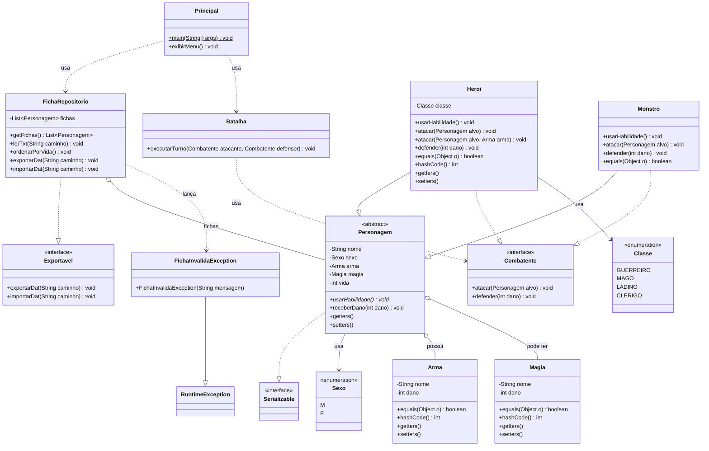

# Diagrama UML — CodexBellum

Diagrama de classes completo do projeto, refletindo o código atual.
O GitHub renderiza este diagrama automaticamente nesta página.

## Legenda das setas

| Seta | Significado |
|---|---|
| `--|>` (linha cheia, triângulo) | herança (`extends`) |
| `..|>` (linha tracejada, triângulo) | implementação de interface (`implements`) |
| `..>` (linha tracejada, aberta) | dependência (usa) |
| `o--` (losango) | agregação (tem um / tem vários) |
| `*` no método | método abstrato |
| `$` no método | método estático |
